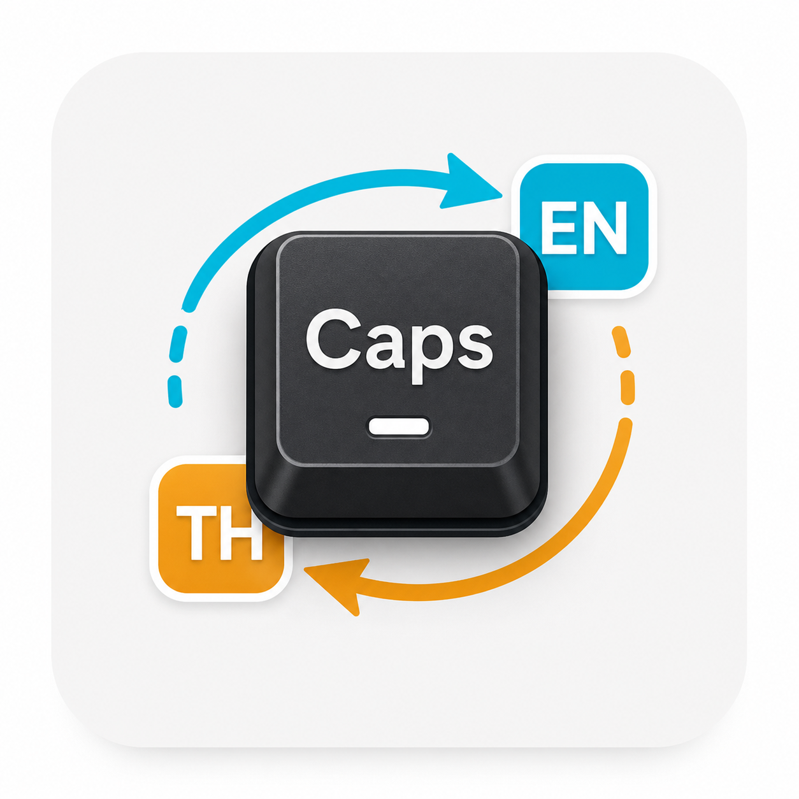

# CapsLang



CapsLang is a small Windows tray app that turns `CapsLock` into a dedicated
input-language switch key.

It does not send `Win+Space`, so fast typing cannot accidentally trigger
shortcuts such as `Win+Space+1` or `Win+Space+D`.

## Features

- Use `CapsLock` to switch to the next Windows input language.
- Keep real CapsLock off during normal typing.
- Leave normal Windows-key shortcuts such as `Win+L` and `Win+Shift+S`
  untouched.
- Show the active Windows input language code near the text insertion caret
  when the active app exposes caret geometry through Windows UI Automation.
- Avoid mouse-pointer based typing feedback.
- Run quietly as a tray app.
- Manage CapsLang, indicator visibility, indicator placement, and startup from
  the tray right-click menu.
- Install from a release ZIP without the .NET SDK.

## Download

Download the latest Windows build:

- [CapsLang-Portable-win-x64.zip](https://github.com/nakorncode/capslang-windows/releases/latest/download/CapsLang-Portable-win-x64.zip) - standalone portable build; extract and run `install-startup.ps1`
- [SHA256 checksums](https://github.com/nakorncode/capslang-windows/releases/latest/download/CapsLang-SHA256SUMS.txt)

Release builds are self-contained. No separate .NET runtime install is required.

## Key Bindings

| Shortcut | Action |
| --- | --- |
| `CapsLock` | Switch to the next input language and keep CapsLock off |
| `Shift+CapsLock` | Toggle real CapsLock on/off intentionally |
| `Ctrl+CapsLock` | Force CapsLock off without switching language |
| Tray menu `Turn CapsLock Off` | Force CapsLock off with the mouse |

## Tray Menu

Right-click the CapsLang tray icon to change runtime settings:

- `CapsLang Enabled`: turn the CapsLock remap on or off. When off, CapsLock
  behaves normally.
- `Show Language Indicator`: show or hide the popup indicator after language
  switching.
- `Indicator Position`:
  - `Follow Text Caret`: show near the text insertion caret when Windows exposes
    caret geometry.
  - `Screen Corner`: keep the indicator in the bottom-right screen corner.
- `Start with Windows`: create or remove the Windows Startup shortcut.
- `Turn CapsLock Off`: force real CapsLock off.

Settings are saved under `%LOCALAPPDATA%\CapsLang\settings.json`.

The indicator is not limited to Thai and English. It uses the active Windows
input language culture, such as `EN-US`, `TH-TH`, `JA-JP`, `KO-KR`, or `ZH-CN`.

## Install From Release ZIP

1. Open the repository's **Releases** tab.
2. Download `CapsLang-Portable-win-x64.zip`.
3. Extract the ZIP.
4. Run PowerShell in the extracted folder.
5. Run:

```powershell
.\install-startup.ps1
```

The installer creates a Windows Startup shortcut and starts `CapsLang.exe`.
You can later turn Startup on or off from the tray right-click menu.

Disable any PowerToys CapsLock remap while CapsLang is running, otherwise both
tools may react to the same key.

## Uninstall

Run this from the same extracted release folder:

```powershell
.\uninstall-startup.ps1
```

## Build From Source

Requirements:

- Windows
- .NET 8 SDK

Run:

```powershell
dotnet build
```

To install from source:

```powershell
.\install-startup.ps1
```

When `CapsLang.exe` is not present in the current folder, the installer builds a
framework-dependent local publish output with the .NET SDK and points the
Startup shortcut at that build.

## Publish Release Assets Locally

```powershell
.\scripts\publish-release.ps1
```

The release assets are written to `artifacts/release`.

## GitHub Release Workflow

Push a version tag to publish a release:

```powershell
git tag v0.1.0
git push origin v0.1.0
```

The GitHub Actions workflow builds a self-contained `win-x64` release ZIP and
checksum file, then uploads them to the GitHub Releases tab.

Release assets:

- `CapsLang-Portable-win-x64.zip`
- `CapsLang-SHA256SUMS.txt`

## Notes

- If CapsLang should work inside elevated administrator apps, run CapsLang as
  administrator too. Normal non-admin apps work without elevation.
- Caret detection uses Windows UI Automation `TextPattern2` first, then older
  text/Win32 caret APIs. Some apps still do not expose exact caret geometry; in
  those cases CapsLang anchors the popup to the focused window instead of the
  mouse pointer.
- CapsLang is Windows-only.

## License

MIT
